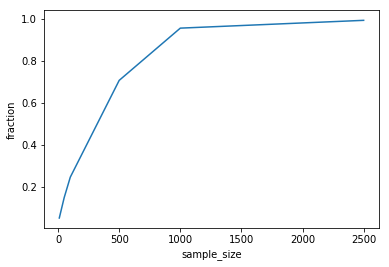
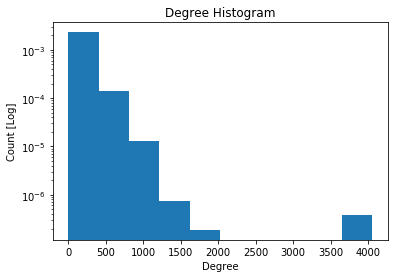
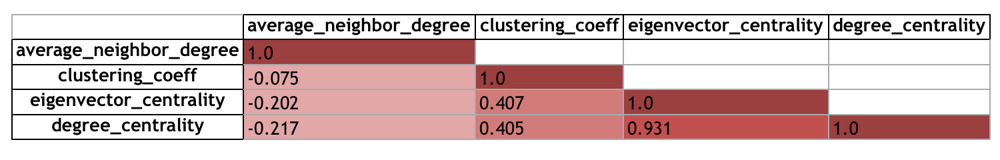
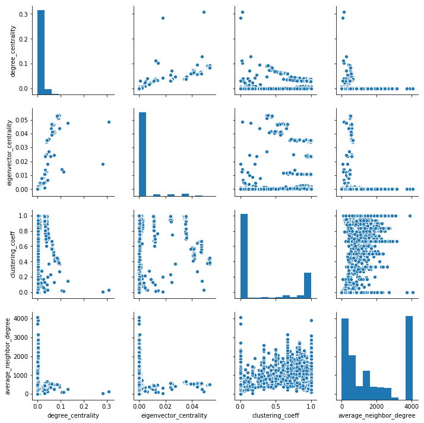

https://medium.com/@ValeriaCortezVD/visualising-stocks-correlations-with-networkx-88f2ee25362e

https://aksakalli.github.io/2017/07/17/network-centrality-measures-and-their-visualization.html

https://www.datacamp.com/community/tutorials/networkx-python-graph-tutorial

API for AS data:

https://peeringdb.com/api/net?asn=42

Other AS information

https://ipinfo.io

# Graph Analysis

## Characteristics

| -                             | **Nodes** | **Edges** |
| ----------------------------- | --------- | --------- |
| *Full graph*                  | 13174     | 310738    |
| *Largest connected component* | 11921     | 310014    |

When we select the largest connect component that is contained in the full graph we get a subgraph that contains $90.5\%$ of all the nodes and $99.8\%$ of the edges that are contained in the full graph.

When we look at the smaller components we find mostly academic, governmental, bank, and telecommunications networks among some others. For some of these categories it could be argued that they are not connected to the larger network, because it is not necessary or perhaps safer for them to be so. **TODO PERHAPS EXPAND ON THIS AND VISUALISE. MAYBE MAP WHERE THESE NETWORKS MAY BE LOCATED**

### Graph Saturation

When we select a range $[10, 50, 100, 500, 1000, 2500]$ of the nodes with the highest degrees and create subgraphs with the links that come from these nodes we find that the graph becomes saturated to the fraction of edges of the largest component far below the the total amount of nodes in the full graph.

### Highest Degree Nodes Information

We first plot the log-linear degree histogram and find that the degree distribution is heavily right skewed.

When we look at the attributes of the 5 highest connected autonomous systems for the full graph we find that these correspond to the following networks.

| **AS** | **Name**                     | **Connected Nodes** | **Link**                            | **Classification** |
| ------ | ---------------------------- | ------------------- | ----------------------------------- | ------------------ |
| 6939   | Hurricane Electric           | 4056                | https://peeringdb.com/net?asn=6939  | Tier 2             |
| 3356   | Level 3 AS 3356              | 3733                | https://peeringdb.com/net?asn=3356  | Tier 1             |
| 12989  | Highwinds Network Group, Inc | 1707                | https://peeringdb.com/net?asn=12989 | CDN                |
| 3257   | GTT Communications (AS3257)  | 1465                | https://peeringdb.com/net?asn=3257  | Tier 1             |
| 2914   | NTT Communications (Global)  | 1364                | https://peeringdb.com/net?asn=2914  | Tier 1             |

## Correlations

We selected some initial metrics to compare with each other to see how they correlate.

### Metric correlation matrix

### Pairplot of metrics

What is interesting about the pair plot is that for most metrics intervals can be observed for many nodes.

**TODO EXPLAIN WHY THIS OBSERVATION MAY BE THE CASE**

## Conclusions

Degree distribution